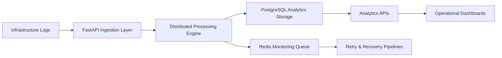
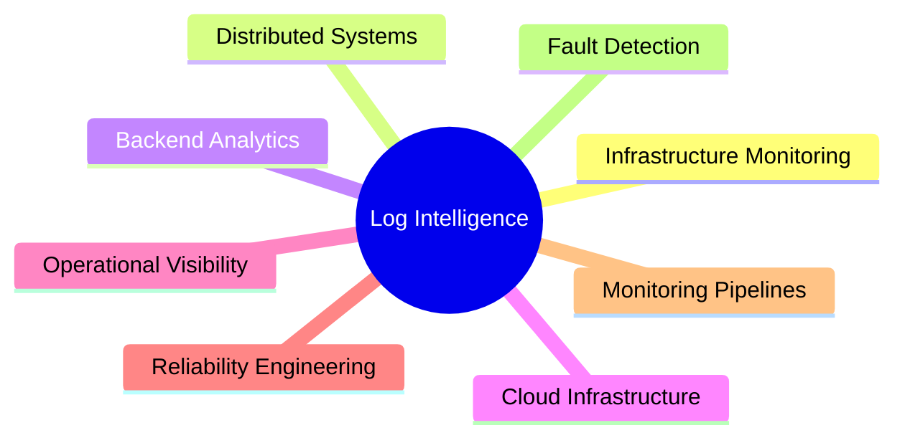

<div align="center">

# CLOUD INFRASTRUCTURE LOG INTELLIGENCE SYSTEM

### Distributed Infrastructure Monitoring • Operational Analytics • Cloud-Native Log Processing


<br>


</div>

---

# Overview

The Cloud Infrastructure Log Intelligence System is a scalable operational monitoring and infrastructure analytics platform engineered to process large-scale server, application, and authentication logs across distributed backend environments.

The platform focuses on:

- Centralized infrastructure observability
- Log ingestion and processing
- Failure analytics
- Authentication anomaly monitoring
- Operational intelligence
- Distributed monitoring workflows
- Infrastructure reliability engineering

The system architecture is designed for cloud-native deployment environments where high-throughput operational monitoring and backend observability are critical.

---

# Engineering Objectives

```yaml
Core Objectives:
  - Centralized Log Intelligence
  - Distributed Monitoring Pipelines
  - Operational Visibility
  - Infrastructure Reliability
  - Real-Time Log Analytics
  - Backend Fault Detection
  - Scalable Monitoring Infrastructure
````

---

# System Workflow



---

# Key Capabilities

| Capability                | Description                        |
| ------------------------- | ---------------------------------- |
| Infrastructure Monitoring | Centralized operational visibility |
| Log Processing            | Distributed backend ingestion      |
| Operational Analytics     | SQL-driven monitoring metrics      |
| Reliability Engineering   | Retry handling & fault workflows   |
| Cloud Infrastructure      | Dockerized AWS-ready deployment    |
| Backend Observability     | Monitoring and analytics pipelines |

---

# Core Features

## Infrastructure Log Processing

* Server log ingestion
* Application event tracking
* Authentication monitoring
* Failure event processing
* Distributed infrastructure visibility

---

## Operational Monitoring

* Timeout detection
* Crash analytics
* Authentication anomaly tracking
* Error aggregation workflows
* Infrastructure health reporting

---

## Distributed Analytics Processing

* Concurrent backend processing
* Distributed ingestion pipelines
* SQL aggregation workflows
* Backend throughput optimization
* Operational reporting systems

---

## Reliability & Fault Handling

* Retry-based processing
* Event recovery workflows
* Fault detection pipelines
* Backend monitoring automation
* Operational resilience engineering

---

# Technology Stack

## Backend Technologies

* Python
* FastAPI
* REST APIs

---

## Databases & Storage

* PostgreSQL
* Redis

---

## Infrastructure & DevOps

* Docker
* AWS EC2
* Linux
* Git

---

# Project Structure

```bash
├── server.py
├── storage.py
├── entities.py
├── contracts.py
├── processors.py
├── endpoints.py
├── monitor_agent.py
├── analytics_engine.py
├── bootstrap_database.py
├── generate_logs.py
├── Dockerfile
├── docker-compose.yml
├── requirements.txt
└── README.md
```

---

# API Endpoints

| Method | Endpoint        | Description                |
| ------ | --------------- | -------------------------- |
| POST   | /logs           | Ingest infrastructure logs |
| GET    | /metrics/errors | Error analytics            |
| GET    | /metrics/auth   | Authentication analytics   |
| GET    | /health         | Platform health check      |

---

# Distributed Monitoring Architecture

```yaml
Monitoring Stack:
  - FastAPI Backend Services
  - PostgreSQL Analytics Storage
  - Redis Queue Infrastructure
  - Distributed Processing Workflows
  - Dockerized Runtime Environment
```

---

# Infrastructure Engineering Focus

The system architecture emphasizes:

* High-throughput log ingestion
* Scalable backend observability
* Distributed monitoring workflows
* Fault recovery engineering
* SQL analytics optimization
* Operational reliability
* Cloud-native deployment support

---

# Operational Intelligence Workflows

The platform supports analytics visibility for:

* Infrastructure failures
* Authentication anomalies
* Server timeout events
* Operational crash detection
* Backend performance analytics
* Monitoring throughput metrics

---

# Deployment

```bash
docker-compose up --build
```

The platform supports rapid deployment across cloud-native backend environments.

---

# Performance Engineering

| Optimization Area | Engineering Focus            |
| ----------------- | ---------------------------- |
| Log Processing    | Distributed ingestion        |
| Analytics         | SQL aggregation optimization |
| Reliability       | Retry recovery workflows     |
| Infrastructure    | Containerized scalability    |
| Monitoring        | Operational visibility       |

---

# Scalability Considerations

The platform architecture supports:

* Horizontal backend scaling
* Distributed event ingestion
* Containerized deployment workflows
* Backend throughput optimization
* Concurrent monitoring pipelines
* Operational observability engineering

---

# Future Enhancements

* Kafka-based log streaming
* Kubernetes orchestration
* AI-driven anomaly detection
* Grafana dashboard integration
* Real-time alert pipelines
* Distributed log partitioning
* Infrastructure auto-healing workflows

---

# Repository Setup

```bash
git clone <repository-url>

cd cloud-log-intelligence-system

docker-compose up --build
```

---

# Engineering Domains



---

# License

This project is intended for engineering demonstration, learning, and portfolio purposes.

---

<div align="center">

### Distributed Infrastructure Monitoring • Operational Intelligence • Cloud Native Observability

</div>
```
